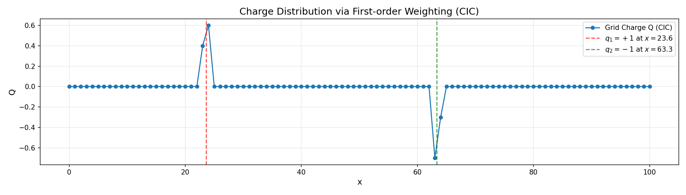
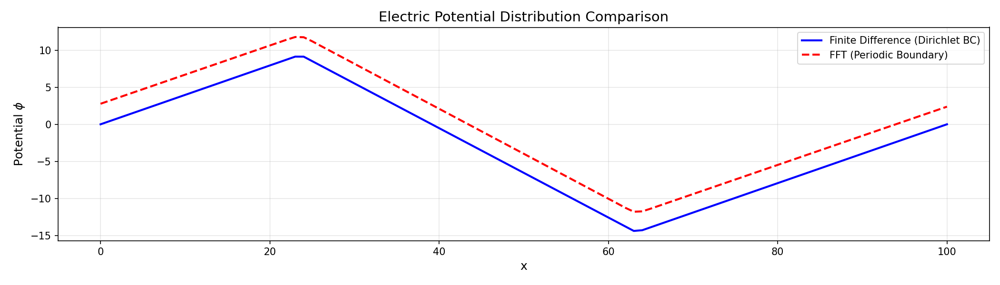
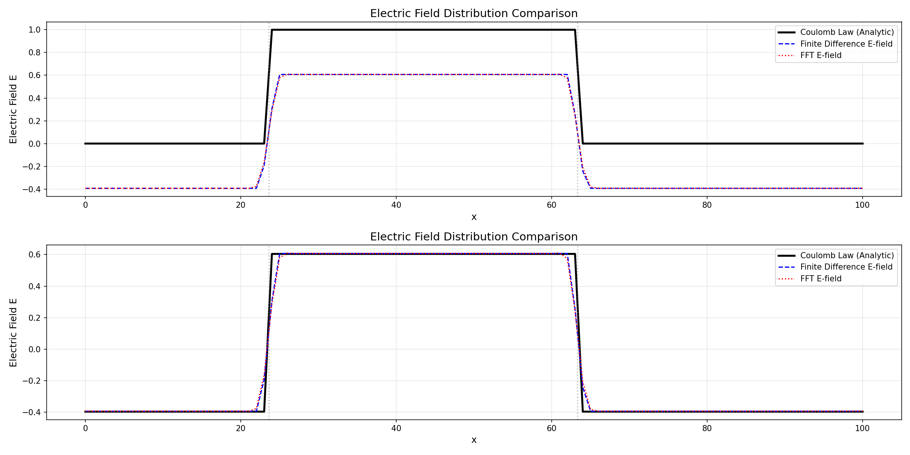

# 一维电场数值计算方法比较分析  
</br>
赵世娟</br>   
2026年4月16日

---

## 1. 问题背景

本代码实现了一维静电场的数值计算，通过有限差分法和快速傅里叶变换（FFT）方法求解泊松方程，并与库仑定律的解析解进行对比分析。

**物理模型：** 在 $[0, 100]$ 区间内存在两个点电荷：
- 电荷 $q_1 = 1.0$ at $x_1 = 23.6$
- 电荷 $q_2 = -1.0$ at $x_2 = 63.3$

真空介电常数取 $\varepsilon_0 = 1.0$。

**计算参数：**
- 网格点数：$N = 101$
- 网格间距：$\Delta x = 1.0$

---

## 2. 电荷分布：一阶权重法 (CIC)

### 2.1 方法原理

将连续分布的电荷投影到离散网格点上。对于一维情况，点电荷 $q$ 位于位置 $x$，网格间距为 $\Delta x$，权重分配如下：

$$
w_{\text{left}} = 1 - \frac{x - i\Delta x}{\Delta x}, \quad w_{\text{right}} = \frac{x - i\Delta x}{\Delta x}
$$

其中 $i = \lfloor x/\Delta x \rfloor$ 为左侧网格索引。

---

### 2.2 代码实现

```python
def deposit_charge(q, x_pos, dx, N):

    Q = np.zeros(N)
    i = int(np.floor(x_pos / dx))
    if i < 0 or i >= N-1:
        return Q
    w_left = 1.0 - (x_pos - i*dx) / dx
    w_right = (x_pos - i*dx) / dx
    Q[i] += q * w_left
    Q[i+1] += q * w_right
    return Q
```

---

### 2.3 结果展示


---

## 3. 泊松方程求解

静电势 $\phi$ 满足泊松方程：

$$
\frac{d^2\phi}{dx^2} = -\frac{\rho}{\varepsilon_0}
$$

离散形式：

$$
\frac{\phi_{i-1} - 2\phi_i + \phi_{i+1}}{\Delta x^2} = -\frac{\rho_i}{\varepsilon_0}
$$

取 $\Delta x = 1.0$, $\varepsilon_0 = 1.0$，简化为：

$$
\phi_{i-1} - 2\phi_i + \phi_{i+1} = -Q_i
$$

---

## 4. 方法一：有限差分法（Dirichlet边界条件）

### 4.1 方法原理

使用 Thomas 算法（追赶法）求解三对角矩阵方程 $\mathbf{A}\phi = \mathbf{b}$：

- 主对角线元素：$-2$
- 次对角线元素：$+1$
- 边界条件：$\phi(0) = \phi(100) = 0$

---

### 4.2 Thomas 算法步骤

1. **向前消元**：计算中间变量 $w_i$ 和 $g_i$
   $$
   w_i = \frac{c_i}{b_i - a_i w_{i-1}}, \quad g_i = \frac{d_i - a_i g_{i-1}}{b_i - a_i w_{i-1}}
   $$

2. **向后回代**：求解内部点电势
   $$
   \phi_i = g_i - w_i \phi_{i+1}
   $$
---

### 4.3 代码实现

```python
def poisson_direct(rho, dx, phi0, phiN):
    N = len(rho)
    d = -dx**2 * rho.copy().astype(float)
    d[1]   -= phi0    # 边界条件修正（内部点 1..N-2）
    d[N-2] -= phiN
    a = np.ones(N-2)      # 下对角线
    b = -2 * np.ones(N-2) # 主对角线
    c = np.ones(N-2)      # 上对角线
    w = np.zeros(N-2)    # Thomas 算法
    g = np.zeros(N-2)
    w[0] = c[0] / b[0]    # 向前消元
    g[0] = d[1] / b[0]
    for i in range(1, N-2):
        denom = b[i] - a[i] * w[i-1]
        w[i] = c[i] / denom
        g[i] = (d[i+1] - a[i] * g[i-1]) / denom
    phi_int = np.zeros(N-2)    # 向后回代
    phi_int[-1] = g[-1]
    for i in range(N-4, -1, -1):
        phi_int[i] = g[i] - w[i] * phi_int[i+1]
    phi = np.zeros(N)    # 组合边界值
    phi[0] = phi0
    phi[1:-1] = phi_int
    phi[-1] = phiN
    return phi
```
---

## 5. 方法二：FFT法（周期边界条件）

### 5.1 方法原理

在傅里叶空间中，泊松方程的解为：

$$
\phi(k) = -\frac{\rho(k)}{k^2}, \quad k \neq 0
$$

其中 $k_n = \frac{2\pi n}{L}$ 为离散波数，$L = 100$ 为计算区域长度。

### 5.2 周期边界条件

周期边界要求 $\phi(0) = \phi(L)$，且平均电势为零（$k=0$ 分量设为零）。

---

### 5.3 代码实现

```python
def poisson_fft_periodic(rho, dx):

    N = len(rho)
    L = N * dx
    
    rho_hat = np.fft.fft(rho)
    k = 2 * np.pi * np.fft.fftfreq(N, d=dx)
    phi_hat = np.zeros(N, dtype=complex)
    # n=0 分量置零（平均电势为零）
    phi_hat[0] = 0.0
    # 非零波数求解: φ_k = -ρ_k / k²
    mask = (k != 0)
    phi_hat[mask] = -rho_hat[mask] / (k[mask]**2)
    # 逆变换取实部
    phi = np.fft.ifft(phi_hat).real
    return phi
```

---

### 5.4 结果展示


---

## 6 电场结果
### 6.1 电场计算

```python
def compute_electric_field(phi, dx):
    """通过电势计算电场: E = -dφ/dx"""
    N = len(phi)
    E = np.zeros(N)
    
    # 中心差分（内部点）
    E[1:-1] = -(phi[2:] - phi[:-2]) / (2*dx)
    
    # 边界点采用前向/后向差分
    E[0] = -(phi[1] - phi[0]) / dx
    E[-1] = -(phi[-1] - phi[-2]) / dx
    
    return E
```

<!-- ## 6. 解析解：库仑定律

### 6.1 方法原理

对于一维情况下的点电荷，电场可由库仑定律直接计算：

$$
E(x) = \frac{q}{4\pi\varepsilon_0} \cdot \frac{x - x_0}{|x - x_0|^3}
$$

实际计算中加一小量 $\varepsilon = 10^{-12}$ 避免奇点：

$$
E(x) = \frac{q}{4\pi\varepsilon_0} \cdot \frac{r}{|r|^3 + \varepsilon}
$$
---

### 6.2 代码实现

```python
def coulomb_field(x, q, x0, epsilon0=1.0):
    """
    点电荷 q 在位置 x0 处产生的电场（沿 x 方向）
    
    Args:
        x: 观测点位置
        q: 电荷量
        x0: 电荷位置
        epsilon0: 真空介电常数
    
    Returns:
        E: 电场值
    """
    r = x - x0
    return (q / (2.0 * epsilon0)) * np.sign(r)
``` -->

---

### 6.2 结果展示


---

## 7 误差来源分析

1. **有限差分法误差**：
   - 差分格式的截断误差（$O(\Delta x^2)$）
   - Dirichlet边界条件引入的边界效应

2. **FFT法误差**：
   - 周期边界条件与实际物理模型的差异
   - 网格分辨率有限带来的aliasing误差

3. **共同误差来源**：
   - 电荷分布的有限分辨率
   - 电场计算中差分近似的离散化误差

<!-- ---

## 8. 结论

两种数值方法均能较好地逼近解析解，误差在同一量级。选择哪种方法取决于具体应用场景：

| 方法 | 适用场景 |
|------|---------|
| **有限差分法** | 非周期问题，边界条件处理灵活 |
| **FFT法** | 周期性问题，计算效率高 |

代码已封装为独立函数，可在其他程序中复用：

```python
from Assion2 import deposit_charge, poisson_direct, poisson_fft_periodic, compute_electric_field
``` -->
